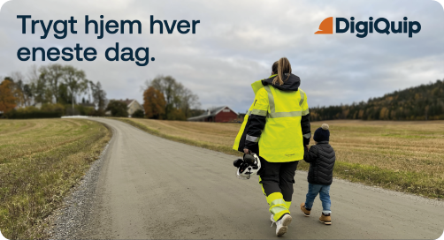

# Opplæring lønner seg (under arbeid)

Det er lett å tenke seg at en person som kan kjøre en lift, kan kjøre en hvilken som helst lift, men slik er det ikke. I dagens raske utviklingstempo kan en type lift være vesentlig ulik fra en annen. Derfor er opplæring nødvendig for å unngå feil bruk, og i verste fall kritiske ulykker.
<!-- truncate -->

Hele poenget med arbeidsmiljøloven er å sikre trygge arbeidsplasser, og budskapet er egentlig veldig enkelt:
+ Arbeidsgiver skal gi de ansatte nødvendig opplæring (aml. §3-2), og 
+ Ansatte har medvirkningsplikt (aml. §2-3)

Det loven sier er at opplæring alltid skal gjennomføres, og alle på arbeidsplassen skal bidra. Så er spørsmålet, når er det nødvendig?

Det er opp til arbeidsgiver å gjøre en vurdering. En god tommelfingerregel er at dersom maskinen eller utstyret kan være farlig, da skal du sørge for utstyrsspesifikk opplæring + noe mer innhold

## Hva er utstyrsspesifikk opplæring?
<!-- truncate -->
Utstyrsspesifikk opplæring, også kalt typeopplæring og maskinspesifikk opplæring, er både enkelt og absolutt nødvendig. Når noen får opplæring på en bestemt maskin før bruk, og den blir dokumentert + noe mer innhold her også ..... så er opplæringen i orden.

**Merk** at utstyrsspesifikk opplæring er noe annet enn et sertifikat eller kurs, det gjelder den bestemte maskinen. 

## Vårt tips?
Samle mennesker og maskiner i en oversikt. Da kan du finne ut av hvem som trenger opplæring, og ikke minst hvem som **ikke** trenger opplæring. 

## Hvorfor?
Det lønner seg! Uendelig mange fordeler: Tid, penger, fremdrift..... + noe mer innhold her også