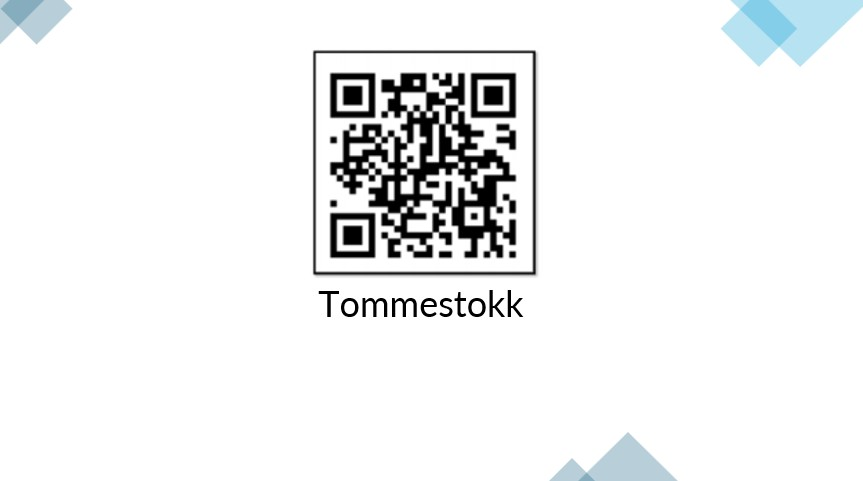

Tips til deg som har ansvar for utstyrsspesifikk opplæring - og kudos til deg for at du setter opplæring på agendaen.
<!-- truncate -->

Opplæring reduserer risikofaktorer og skader ved bruk av utstyr. For hver type utstyr som kan forårsake skade, er det essensielt med tilpasset opplæring. Å prioritere dette i en hektisk hverdag kan være utfordrende, men de ansatte finner ofte opplæringen nyttig.

## Fem kjappe om opplæring

1. **Opplæring lønner seg!**
Opplæring og erfaring gjør at noen team og virksomheter presterer bedre enn andre, ergo gir opplæring god økonomi og konkurransekraft.

2. **Det er større sannsynlighet for at noe går feil uten opplæring.**

Hvis en ulykke inntreffer, er manglende opplæring en veldig dårlig grunn.

3. **Opplæring lar seg ikke dokumentere så det er bare å droppe det.**

Nei da, dette punktet er HELT feil!

>“There is only one way to eat an elephant: a bite at a time” - Desmond Tutu.

4. **Utstyrsspesifikk opplæring er arbeidsgivers ansvar.**

I tillegg er det lovpålagt.

5. **Det er ingen snarveier.**

Jobb smart og systematisk med hvordan dere gjennomfører og dokumenterer utstyrsspesifikk opplæring, selv om det kan virke overveldende i starten.

## Har dere mye utstyr som dere mangler dokumentasjon på?

Har dere utstyr som er mer i bruk eller åpenbart farligere enn annet? **Prioriter og jobb systematisk gjennom.**

**Kombiner opplæring for lignende utstyr for å spare tid.** Gjennomfør opplæringen på flere utstyr samtidig og demonstrer forskjellene der og da. Dette kan være en smart strategi som vil både spare dere for tid samtidig som opplevelsen for de ansatte blir bedre.

## Tips for å komme godt i gang
• Kommuniser tydelig om opplæringens betydning, bygg kultur og gjennomfør opplæringen digitalt slik at dere får minimalt med etterarbeid.

• Bruk HMS-kort for å knytte opplæring direkte og automatisk til din virksomhet.

• Utnytt kunstig intelligens for å gjenkjenne utstyr, men merk gjerne opp utstyr med QR-koder eller tags. Merking gjør det raskere og enklere for folk som skal bruke utstyret og minimerer feilregistreringer.

• Grupper utstyr, og print eventuelt ut plakater eller ark. Dette gjør det enklere å gi opplæring på flere utstyr samtidig.

• Definer hvem som kan gi opplæring på vegne av din organisasjon for bedre kontroll og oversikt senere.

• Grupper utstyr og personer for god oversikt og oppfølging.

Spørsmål? Ta kontakt og så hjelper vi dere i gang!

**Test selv da vel! For moro skyld, ser du her en QR-kode for en tommestokk:**
