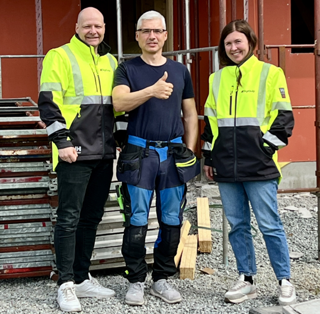

Et uanmeldt besøk fra Arbeidstilsynet kan være en stressende opplevelse for enhver bedrift. For SD Byggentreprenør AS ble et slikt besøk starten på en reise for å forbedre deres HMS-rutiner og sikre at de fulgte reglene for opplæring på farlig arbeidsutstyr – en prosess som kan være verdifull for alle bedrifter som ønsker å styrke sin HMS-praksis.
<!-- truncate -->

Den 3. april 2025 gjennomførte Arbeidstilsynet et uanmeldt besøk på et av SDs prosjekter. De fant ut at to arbeidstakere brukte farlig arbeidsutstyr uten å ha dokumentert opplæring eller utstyrsspesifikk opplæring på det aktuelle utstyret. Som følge av dette fikk SD beskjed om at det kunne være nødvendig å gi virksomheten pålegg, men selskapet fikk mulighet til å rette opp manglene før Arbeidstilsynet besluttet dette endelig.

For å unngå pålegg og sikre at deres HMS-rutiner var i tråd med reglene, tok Slawomir Dlutowski, daglig leder i SD Byggentreprenør AS, kontakt med DigiQuip, et selskap som tilbyr digitale løsninger for HMS-dokumentasjon og -opplæring. DigiQuips Cathrine Westbye og Tom Freddy Braathen hjalp Dlutowski med å forbedre rutinene og få på plass nødvendig dokumentasjon.

"Med DigiQuips hjelp, spesielt fra Cathrine og Tom Freddy, fikk vi raskt på plass rutiner og dokumentasjon som viser hvilke krav som stilles til personer som bruker farlig arbeidsutstyr," forteller Slawomir Dlutowski. "Vi tok også i bruk Kvipp Småbedrift, DigiQuips digitale HMS-verktøy tilpasset mindre virksomheter, for å dokumentere utstyrsspesifikk opplæring."

Kvipp Småbedrift er et brukervennlig verktøy som hjelper bedrifter med å holde oversikt over ansattes kompetanse og opplæring, samt sikre at all nødvendig dokumentasjon er på plass. "Vår visjon er å være Norges ledende løsning for enkel og sporbar utstyrsspesifikk opplæring og tryggere bruk av arbeidsutstyr," forklarer Tom Freddy Braathen, Chief Commercial Officer i DigiQuip.

For små og mellomstore bedrifter kan dette være avgjørende for å følge lover og regler, unngå bøter fra Arbeidstilsynet og samtidig skape en tryggere arbeidsplass.

I svarbrevet til Arbeidstilsynet forklarte SD de nye rutinene: "Arbeidsgiver har laget rutiner som sørger for at farlig arbeidsutstyr bare brukes av arbeidstakere som har fått nødvendig og dokumentert opplæring. All opplæring på spesifikt arbeidsutstyr skal dokumenteres og lagres i Kvipp Småbedrift."
Ved å gjøre disse endringene før Arbeidstilsynet vedtok pålegg rettet SD opp i forholdene, og unngikk å få pålegg. Måten selskapet håndterte situasjonen på, viser at rask handling og samarbeid er viktig for å følge HMS-regler.

"Vi i DigiQuip er glade for å kunne hjelpe bedrifter som SD Byggentreprenør AS med å forbedre sine HMS-rutiner." sier Cathrine Westbye. "Kvipp Småbedrift gir bedrifter oversikt over utstyrsspesifikk opplæring og nødvendig dokumentasjon, noe som bidrar til tryggere arbeidsplasser og at ansatte kommer trygt hjem hver dag."

For bedrifter som ønsker å styrke sin HMS-praksis og sikre etterlevelse av regelverket, kan erfaringene til SD Byggentreprenør AS være til stor inspirasjon. Ved å ta i bruk digitale verktøy kan virksomheter enkelt etablere nødvendige rutiner og dokumentasjon på en effektiv og strukturert måte. Dette bidrar ikke bare til å oppfylle lovpålagte krav, men også til å skape en tryggere og mer ansvarlig arbeidsplass der de ansatte blir godt ivaretatt.

**Kontaktinformasjon:**

For SD Byggentreprenør AS:
Slawomir Dlutowski, Daglig leder
sd.byggentreprenor@gmail.com

For DigiQuip:
Tom Freddy Braathen, Chief Commercial Officer
tom-freddy@digiquip.no